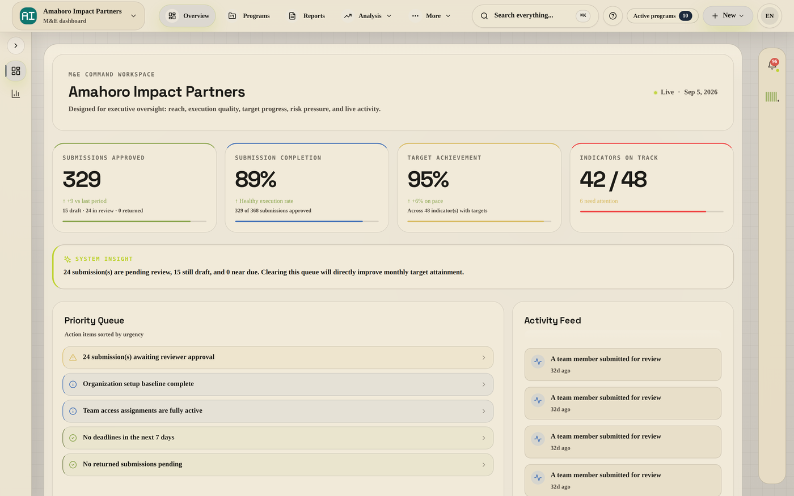
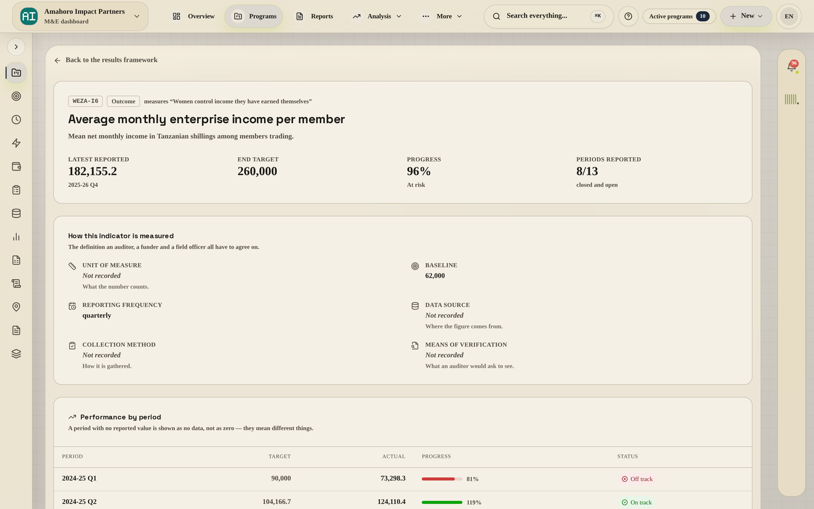
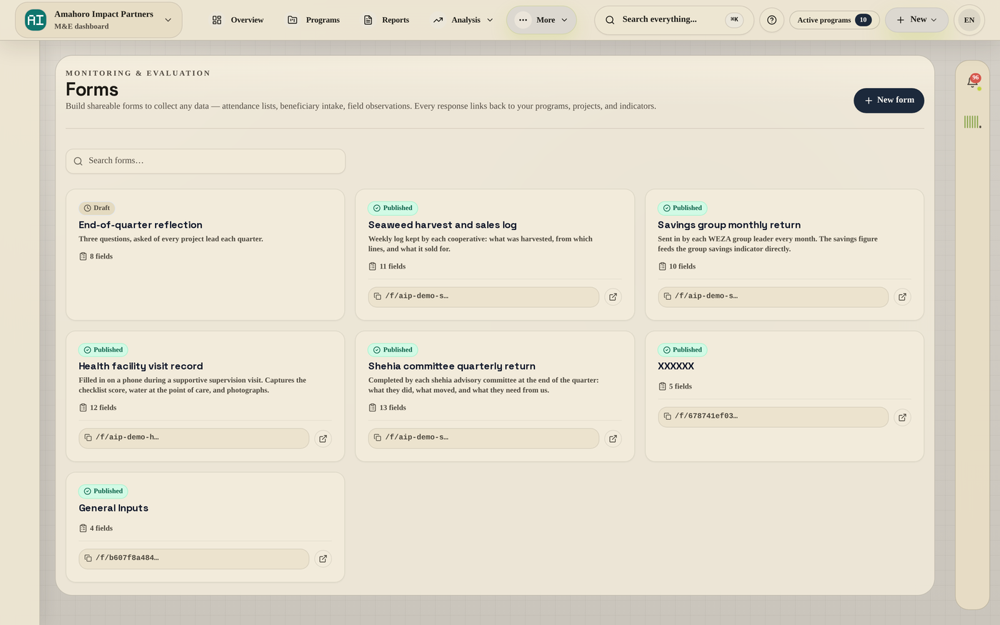

<div align="center">


# ImpactMEL Documentation

**The user manual, video library and reference for the ImpactMEL platform.**

Monitoring, evaluation and learning software for organisations that have to
prove what happened — and show their working.

[**Read the docs →**](https://docs.impactmel.com) &nbsp;·&nbsp;
[Product site](https://impactmel.com) &nbsp;·&nbsp;
[Book a demo](https://calendly.com/impactmel/30min)

<sub>13 manual pages &nbsp;·&nbsp; 7 guides &nbsp;·&nbsp; 47 recorded walkthroughs &nbsp;·&nbsp; built with VitePress</sub>

</div>

---



<table>
<tr>
<td width="50%"></td>
<td width="50%"></td>
</tr>
</table>

---

## What is documented here

| Section | Covers |
|---|---|
| **[User manual](user-manual/)** | Every screen a user meets: programmes and projects, the results framework, indicators, data entry, forms, activities, reports, roles and permissions, settings |
| **[Guide](guide/)** | Quick start, why ImpactMEL, security and compliance, pricing, roadmap and changelog |
| **[Videos](videos/)** | 47 recorded walkthroughs, from signing in to publishing a shared form — each one a real screen, not a mockup |

Documentation is written against shipped behaviour. Where the platform does not
do something, the manual says so rather than describing an intention.

## Running it locally

```bash
npm install
npm run dev      # http://localhost:5173
npm run build    # static site into .vitepress/dist
npm run preview  # serve the built site
```

Node 18 or newer.

## Repository layout

```
guide/               setup, rationale, security, pricing, roadmap
user-manual/         one page per area of the product
videos/              the walkthrough index
public/videos/       47 mp4 walkthroughs
public/user-manual/  screenshots used in the manual
.vitepress/          VitePress config and theme
```

## Contributing

Documentation changes follow the product, not the other way round. Before
adding a page, check that the behaviour it describes has actually shipped.

1. Branch from `main`
2. Keep one topic per page and British spelling throughout
3. Run `npm run build` before opening a pull request — a broken link fails the build
4. Screenshots go in `public/user-manual/images/`; walkthroughs in `public/videos/`

## Deployment

Built by VitePress and deployed to **[docs.impactmel.com](https://docs.impactmel.com)**.
`vercel.json` pins the build command and output directory.

---

<div align="center">
<sub>© ImpactMEL &nbsp;·&nbsp; <a href="mailto:inquiry@impactmel.com">inquiry@impactmel.com</a></sub>
</div>
